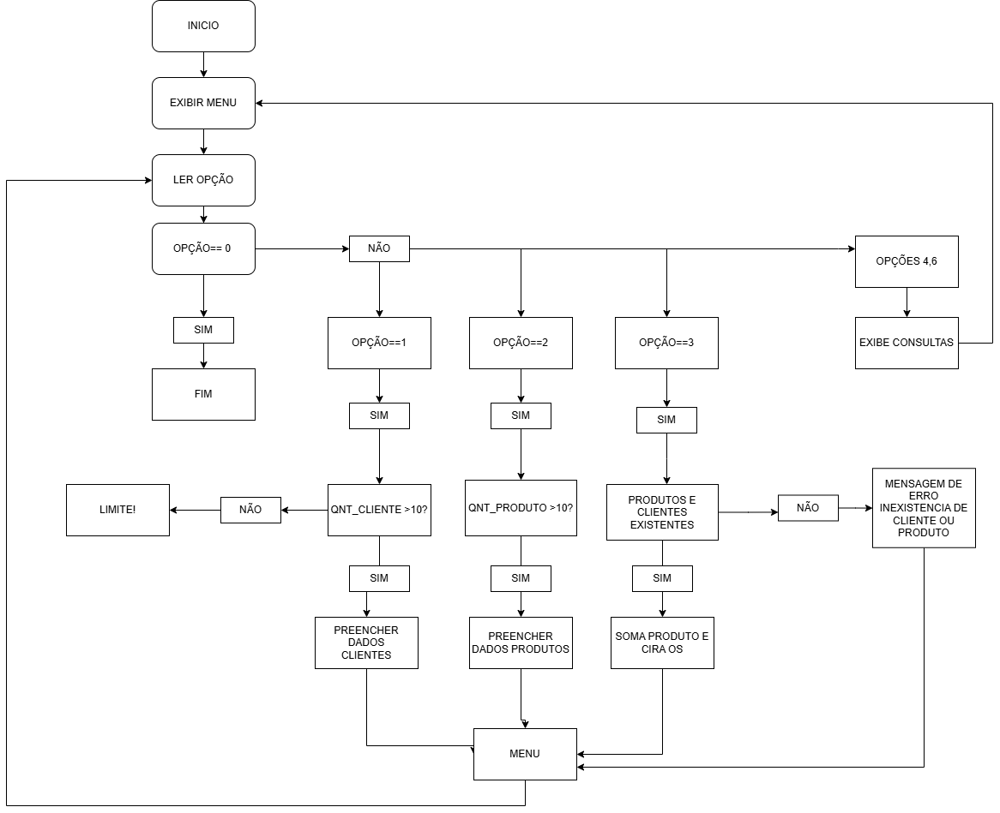

# Sistema de Cadastro e Ordem de Serviço
### Este projeto implementa um sistema simples de cadastro de clientes, produtos e criação de ordens de serviço (OS) utilizando Portugol Studio.

#### Funcionalidades
2. Cadastro de Clientes
- Permite cadastrar até 10 clientes.
- Cada cliente recebe um código gerado automaticamente.
- Cadastro de Produtos

3. Permite cadastrar até 10 produtos.
- Cada produto recebe um código gerado automaticamente.
- É possível definir o preço de cada produto.
- Criação de Ordens de Serviço (OS)

3. Seleção de cliente e produto por índice.
- Definição da quantidade do produto.
- Cálculo automático do valor total da OS.
- Exibição de Dados

4. Exibição de Dados
- Lista de clientes cadastrados.
- Lista de produtos cadastrados com preços formatados.
- Lista de ordens de serviço com detalhes (cliente, produto, quantidade e total).

5. Menu Interativo
- Navegação por opções numéricas para acessar as funcionalidades.
# fluxograma
- Um nó inicial "Início"
- Conexão para "Exibir Menu"
- Conexão para "Ler Opção"
- Uma decisão "Opção == 0?" (para sair)
 - Se não for 0, uma estrutura de seleção (switch case) com:
 - Caso 1: Fluxo de cadastro de cliente
 - Verificação se há espaço (qtdClientes < 10)
 - Leitura de dados
 - Incremento de contador
- Caso 2: Fluxo similar para produtos
- Caso 3: Fluxo para criar OS
- Verificar clientes/produtos existentes
- Calcular total
- Incrementar qtdOS
- Casos 4-6: Fluxos de exibição (simples listagem)
- Todos os casos retornam ao menu principal
- A opção 0 vai para "Fim"

### Estrutura do Código

#### Variáveis Globais
- Arrays para armazenar clientes, produtos e ordens de serviço.
- Contadores para controlar a quantidade de registros.

#### Funções
- **mostrarRealFormatado:** Exibe valores com 2 casas decimais.
- **cadastrar:** Realiza o cadastro de clientes ou produtos.
- **exibir:** Exibe clientes, produtos ou ordens de serviço.
- **criarOS:** Cria uma nova ordem de serviço.
- **inicio:** Função principal que controla o menu e a execução do programa.

## Como Executar
1. **Abra o Portugol Studio**
- Certifique-se de que o Portugol Studio está instalado no seu computador.

2. **Carregue o Arquivo**
- Abra o arquivo main.por no Portugol Studio.

3. **Execute o Programa**
- Clique no botão "Executar" (ícone de play) ou pressione F5.

4. **Interaja com o Menu**
- Escolha as opções exibidas no menu digitando o número correspondente e siga as instruções.

Menu Principal
1. **Cadastrar Cliente**
Insere um novo cliente no sistema.

2. **Cadastrar Produto**
Insere um novo produto no sistema.

3. **Criar Ordem**
Gera uma ordem de serviço selecionando cliente, produto e quantidade.

4. **Exibir Clientes**
Lista todos os clientes cadastrados.

5. **Exibir Produtos**
Lista todos os produtos cadastrados com seus preços.

6. **Exibir Ordens**
Lista todas as ordens de serviço criadas.

0. **Sair**
Encerra o programa.

## Exemplo de Uso
- **Cadastrar Cliente**
Nome: João Silva
Código gerado: 1

- **Cadastrar Produto**
Nome: Notebook
Preço: R$ 3000,00
Código gerado: 1

- **Criar Ordem de Serviço**
Cliente: João Silva
Produto: Notebook
Quantidade: 2
Total: R$ 6000,00

# Limitações
O sistema suporta até 10 clientes, 10 produtos e 10 ordens de serviço.
Os índices de cliente e produto começam em 1 para facilitar a interação do usuário.

---
Este projeto foi desenvolvido como parte de estudos em lógica de programação utilizando o Portugol Studio.
